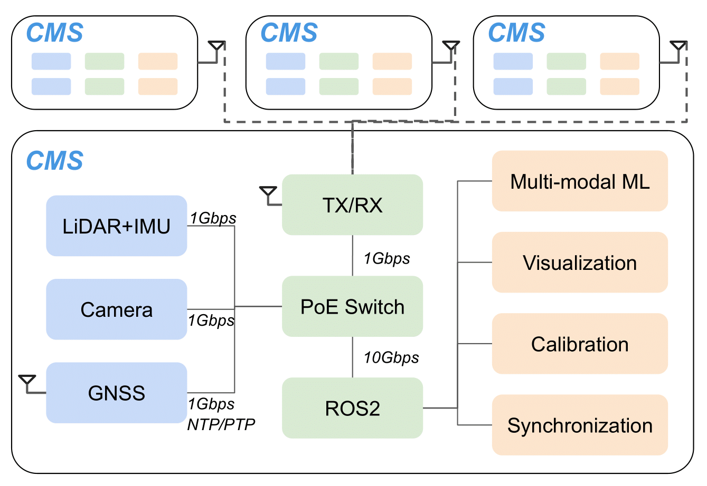

<link href='https://fonts.googleapis.com/css?family=Titillium+Web:400,600,400italic,600italic,300,300italic' rel='stylesheet' type='text/css'>
<head><meta http-equiv="Content-Type" content="text/html; charset=UTF-8">
  <title>NO-PUSH: Networked Open-source Portable Universal Sensing Hub</title>

<!-- <meta property="og:image" content="images/teaser_fb.jpg"> -->
<meta property="og:title" content="TITLE">

<!-- Global site tag (gtag.js) - Google Analytics -->

<link media="all" href="./css/glab.css" type="text/css" rel="StyleSheet">

<link media="all" href="./css/slideshow.css" type="text/css" rel="StyleSheet">

<meta content="MSHTML 6.00.2800.1400" name="GENERATOR"></head>

<body data-gr-c-s-loaded="true">

<h1><strong>CMS: Enabling Real-world Cooperative Multi-modal Sensing</strong></h1>

<h2> 
    <a href="www.linkedin.com/in/bowu123/">Bo Wu</a>
    &nbsp;&nbsp;&nbsp;
    <a href="https://www.linkedin.com/in/jerryli2025/">Jerry Li</a>
    &nbsp;&nbsp;&nbsp;
    <a href="https://hangqiu.github.io/">Hang Qiu</a>
   </h2>

<h2>
        <a href="https://www.ucr.edu">University of California, Riverside</a>&nbsp;&nbsp;&nbsp; 
</h2>

<!-- 
Hotmobile 2025
 -->

<h2><a href="https://arxiv.org/abs/2112.14947">Paper</a> | <a href="https://github.com/UCR-CISL/NO-PUSH/tree/main">Code</a> | <a href="https://youtu.be/uBmdCRmZNIo">Demo</a> | <a href="#bibtex">Bibtex</a> </h2>

<table border="0" cellspacing="10" cellpadding="0" align="center"> 
<tbody><tr><td><left>
<!-- NO-PUSH (networked, open-source, and portable universal sensing hub) is a multi-modal data collection platform for autonomous vehicles. Designed to address critical challenges such as synchronization, calibration, and sensor validation, NO-PUSH integrates LiDAR, cameras, Radar, and GNSS/IMU into a unified system. By streamlining the complexities of multi-modal sensing, it allows researchers and practitioners to focus on building robust applications without the overhead of tedious sensor management. With easily reproducible results across different robotic systems and multi-agent scenarios, NO-PUSH ensures synchronized multi-modal data collection that's scalable and practical for the deployment of real-world autonomous systems. -->
CMS, an open-source, cooperative multi-modal sensing
platform. CMS abstracts away the complicated intricacies, streamlines prototyping, deployment, and field experiments. Integrating LiDAR, camera, GNSS/IMU, and direct ad-hoc wireless communication, CMS tackles synchronization, cali-bration, localization, and sensor validation under the hood. Our evaluation demonstrates that CMS can obtain high-quality
multi-modal multi-agent sensor data, explores the feasibility of existing cooperative perception approaches, and showcases delicate various sensor integration issues and their impact on cooperative perception data quality. CMS will be open-sourced,
easily reproducible for different robots and multi-agent research.
</left></td></tr></tbody></table>

<table border="0" cellspacing="10" cellpadding="0" align="center">
  <tbody><tr><td align="center">

</td></tr>
</tbody>
</table>

<h1 align="center">CMS Overview</h1>
<table border="0" cellspacing="10" cellpadding="0" align="center"> 
<tbody>
<tr><td><left>
<!-- The prototype includes four different sensors connected to a power-over-ethernet (PoE) switch, which forwards the data to a central ROS node (running on a laptop). The laptop and sensors are synchronized with GNSS time, and all intrinsic and extrinsic parameters are calibrated for all sensors. TX/RX module communicates with other NO-PUSH platforms and the infrastructure. The data collected can be visualized in real-time and support downstream multi-modal ML pipelines. -->
CMS integrates LiDAR, Camera, GNSS with a
power-over-ethernet (PoE) switch, which forwards the data to a central ROS
node (running on a laptop). The laptop and sensors are synchronized with
GNSS time, and all intrinsic and extrinsic parameters are calibrated for all
sensors. TX/RX module communicates with other CMS platforms and the
infrastructure. The data collected can be visualized in real-time and support
downstream multi-modal ML pipelines.
</left>
</td></tr>
<tr><td>
<!-- <video muted autoplay loop width="1000" controls> -->
  <!-- <source src="./media/AutoCastOverview.mp4" type="video/mp4"> -->

<!-- </video> -->
</td></tr>
</tbody>
</table>

<tr>
  <td align="center">
  <h1 align="center">Demo of CMS</h1>
    

      This video demonstrates the capabilities of CMS, it showcases synchronization, multi-agent communication and sensor fusion, enabling scalable deployment
      in real-world autonomous systems.
    

  </td>
</tr>
<tr>
  <td align="center">
    <video controls width="800">
      <source src="./media/CMS_1-3.mp4" type="video/mp4">
      Your browser does not support the video tag.
    </video>
  </td>
</tr>

<!--
 

<table align=center width=1000px>

<tr><td><left>

<h1>Acknowledgements</h1>

We would like to thank

</left></td></tr></table>

  
-->

<!-- GoStats JavaScript Based Code -->

<noscript></noscript>

<!-- End GoStats JavaScript Based Code -->
<!-- 

</body>
 -->

